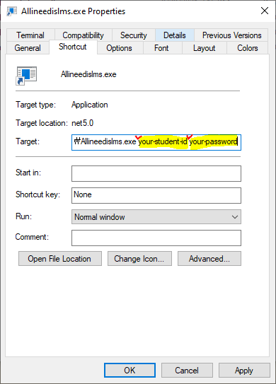

# Allineedislms

> All I need is LMS

***IEILMS*** is ***L**earning **M**anagement **S**ystem* operated by ***I**nstitute for **E**ducation **I**nnovation* in *Jeonbuk National University*. There're are both [OLD](ieilmsold.jbnu.ac.kr) and [NEW](ieilms.jbnu.ac.kr) versions of this system, so each class may have a different version of the system used.

To prevent this confusion, *Allineedislms* was designed to allow users to choose a version of *LMS* for each course. *Allineedislms* provides **automatic login** and **class web page navigation** features.

# Dependency
* [.NET 5.0](https://dotnet.microsoft.com/download)


# Test running webbrowser with LMS logged in

**NOTE that it may or may not work with your computer specification or browser.**

* i7-6700 CPU 3.40GHz, RAM 8GB
* Windows 10 (64-bit)
- [x] **Google Chrome** 92.0.4515.159 (Official Build) (64-bit)
- [x] **Opera Browser** 78.0.4093.184 (64-bit)
- [x] **NAVER Whale** 2.10.123.42 (Official Build) (64-bit)
- [x] **Microsoft Edge** 92.0.902.84 (Official build) (64-bit)
- [x] **Firefox** 91.0.2 (64-bit)
  * MUST tick `Open links in tabs instead of new windows` in setting
- [x] **Internet Explorer** 21H1 (Build 19043.1165)

# Usage

## Sign in LMS
```
JBNU id: <your-student-id>
password: <your-password>
- Sign in Old-LMS ... SUCCESS !
- Sign in New-LMS ... SUCCESS !
- Get class list from LMS ... SUCCESS !
- Serialize file "lmsdata.json"
```
And you can sign in IEILMS automatically.

1. **Create shortcut** of Allineedislms.exe.
2. Open **properties** window of Allineedislms.exe.
3. Input ID and Password separated with space character in **Target** textbox.
    ```
    <path>\Allineedislms.exe <your-student-id> <your-password>
    ```
    
4. Execute a new shortcut file.

## Choose versions of LMS

After logging in, your class course list can be viewed as a table as follows:

| index | old-LMS | new-LMS | title                  | class-# | professor | #-students |
|-------|---------|---------|------------------------|---------|-----------|------------|
| 1     |         |         | 소프트웨어공학         | 2       | 가가가    | 45         |
| 2     |         |         | 컴파일러               | 1       | 나나나    | 21         |
| 3     |         |         | 확률및통계             | 2       | 다다다    | 22         |
| 4     |         |         | 정보보호               | 1       | 라라라    | 39         |
| 5     |         |         | 파일구조               | 2       | 마마마    | 20         |
| 6     |         |         | 기계학습               | 2       | 바바바    | 15         |
| 7     |         |         | 오픈소스소프트웨어개발 | 1       | 사사사    | 32         |
| 8     |         |         | 전공진로설계           | 100     | 아아아    | 5          |

First, let's choose **old-LMS** for subject number 2 and 4.

```
박주빈> o 2 4
```
Or
```
박주빈> old 2 4
```

| index | old-LMS | new-LMS | title                  | class-# | professor | #-students |
|-------|---------|---------|------------------------|---------|-----------|------------|
| 1     |         |         | 소프트웨어공학         | 2       | 가가가    | 45         |
| 2     | v       |         | 컴파일러               | 1       | 나나나    | 21         |
| 3     |         |         | 확률및통계             | 2       | 다다다    | 22         |
| 4     | v       |         | 정보보호               | 1       | 라라라    | 39         |
...

However, you want to change subject number 4 to new-LMS. Enter the command as shown below:

```
박주빈> n 4
```
Or
```
박주빈> new 4
```

| index | old-LMS | new-LMS | title                  | class-# | professor | #-students |
|-------|---------|---------|------------------------|---------|-----------|------------|
| 1     |         |         | 소프트웨어공학         | 2       | 가가가    | 45         |
| 2     | v       |         | 컴파일러               | 1       | 나나나    | 21         |
| 3     |         |         | 확률및통계             | 2       | 다다다    | 22         |
| 4     |         | v       | 정보보호               | 1       | 라라라    | 39         |
...

You can also check both columns:

```
박주빈> b 1 3 5
```
Or
```
박주빈> both 1 3 5
```

| index | old-LMS | new-LMS | title                  | class-# | professor | #-students |
|-------|---------|---------|------------------------|---------|-----------|------------|
| 1     | v       | v       | 소프트웨어공학         | 2       | 가가가    | 45         |
| 2     | v       |         | 컴파일러               | 1       | 나나나    | 21         |
| 3     | v       | v       | 확률및통계             | 2       | 다다다    | 22         |
| 4     |         | v       | 정보보호               | 1       | 라라라    | 39         |
| 5     | v       | v       | 파일구조               | 2       | 마마마    | 20         |
...

Of course, it's possible to clear them:
```
박주빈> c 3 1
```
Or
```
박주빈> clear 3 1
```

## Navigating to LMS with webbrowser

| index | old-LMS | new-LMS | title                  | class-# | professor | #-students |
|-------|---------|---------|------------------------|---------|-----------|------------|
| 1     |         |         | 소프트웨어공학         | 2       | 가가가    | 45         |
| 2     | v       |         | 컴파일러               | 1       | 나나나    | 21         |
| 3     |         |         | 확률및통계             | 2       | 다다다    | 22         |
| 4     |         | v       | 정보보호               | 1       | 라라라    | 39         |
| 5     | v       | v       | 파일구조               | 2       | 마마마    | 20         |
| 6     |         |         | 기계학습               | 2       | 바바바    | 15         |
| 7     |         |         | 오픈소스소프트웨어개발 | 1       | 사사사    | 32         |
| 8     |         |         | 전공진로설계           | 100     | 아아아    | 5          |

Now it's time to go to the page of the selected subjects. This program launches the **default webbrowser** that you set up.

```
박주빈> run
- Sign in Old-LMS with webbrowser
- Sign in New-LMS with webbrowser
- Navigate to Old-LMS 컴파일러 with webbrowser - http://ieilmsold.jbnu.ac.kr/course/view.php?id=XXXXX
- Navigate to New-LMS 정보보호 with webbrowser - https://ieilms.jbnu.ac.kr/mypage/group/groupPage.jsp?group_id=XXXXX
- Navigate to Old-LMS 파일구조 with webbrowser - http://ieilmsold.jbnu.ac.kr/course/view.php?id=XXXXX
- Navigate to New-LMS 파일구조 with webbrowser - https://ieilms.jbnu.ac.kr/mypage/group/groupPage.jsp?group_id=XXXXX
```

We didn't finish introducing the instructions, so if you're curious, type `help`.